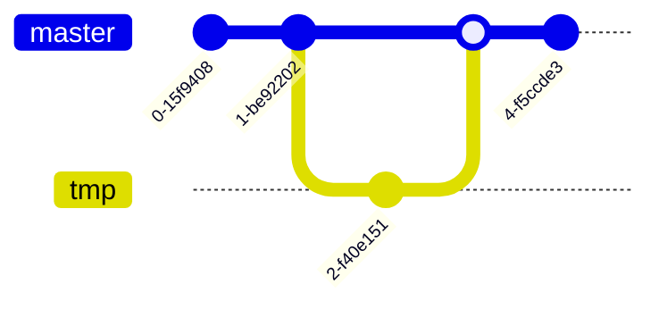

# Mermaid Examples

## Types

### Flowchart


### Sequence Diagram


### Class Diagram


### State Diagram


### Entity Relationship Diagram


### Journey


### Gantt

```mermaid
gantt
  dateFormat MM-DD
  title Something
  excludes weekends

  section A
    x: done, id_x, today, 7d
    y: active, id_y, after id_x, 2d

  section B
    t: crit, active, id_t, today, 3d
    v: milestone, after id_t
    u: id_u, after id_y, 1d
```

### Pie Chart


### Requirement Diagram


### Gitgraph (Git) Diagram



## Details

### Sequence Diagram

https://mermaid-js.github.io/mermaid/#/sequenceDiagram

https://mermaid-js.github.io/mermaid/#/sequenceDiagram?id=configuration


### Gitgraph (Git) Diagram

https://mermaid-js.github.io/mermaid/#/gitgraph


